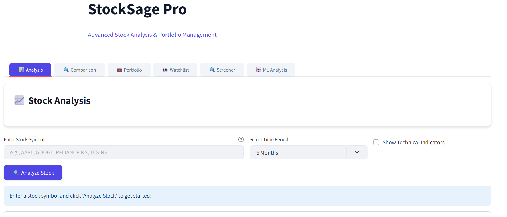
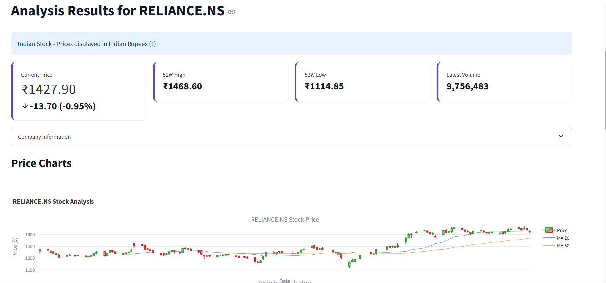
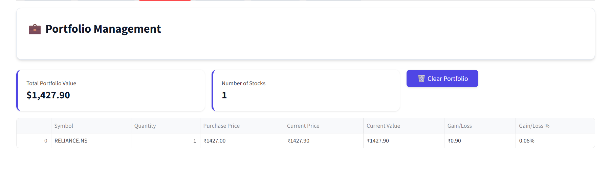
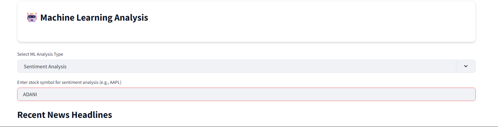

# StockSage: Advanced Stock Analysis Dashboard

A powerful, extensible Streamlit-based dashboard for stock analysis, portfolio management, and machine learning-driven insights. Integrates real-time data, news sentiment, custom alerts, and more.



---

## 📸 Screenshots

| Feature | Screenshot |
|---------|------------|
| Main Dashboard |  |
| Stock Analysis |  |
| Portfolio View |  |
| ML Predictions |  |

*Note: Add your actual screenshots to the `screenshots` directory after setting up the project.*

---

## 🚀 Features

### Core Analytics
- **Real-time Stock Data**: Fetch live data from Yahoo Finance
- **Interactive Charts**: Candlestick, line, and custom indicator charts
- **Technical Indicators**: MA, RSI, MACD, Bollinger Bands, and more
- **Volume & Volatility Analysis**: Visualize trading volume and rolling volatility
- **Stock Screener**: Filter stocks by price, P/E, market cap, volume, and sector
- **Comparison Tool**: Compare multiple stocks side by side

### Portfolio & Watchlist
- **Portfolio Management**: Add, track, and analyze your holdings
- **Watchlist**: Save and monitor favorite stocks
- **Portfolio Optimization**: Modern Portfolio Theory, risk metrics, and optimal weights

### Machine Learning & Advanced Analytics
- **Price Prediction**: LSTM-based next-day price forecasting
- **Direction Classification**: ML model predicts up/down movement
- **Anomaly Detection**: Identify unusual price/volume events
- **Risk Assessment**: Volatility, Sharpe, Sortino, VaR, CVaR, Beta, Max Drawdown

### Sentiment & News
- **News Sentiment Analysis**: Fetch news, compute sentiment, and plot trends
- **Headline & Description Scoring**: Uses VADER for robust sentiment
- **Rolling Sentiment Trend**: Smooths daily sentiment for better insight

### Alerts & Customization
- **In-App Alerts**: Set price or indicator triggers and get instant feedback
- **Email Alerts**: Receive notifications when your alert is triggered
- **Custom Indicator Builder**: Define and plot your own formulas using built-in technical indicators
- **Interactive Visualization**: Real-time plotting of custom indicators alongside price data
- **User Customization Tab**: All-in-one interface for managing alerts and custom indicators
- **Formula Validation**: Built-in error handling for custom indicator formulas
- **Save/Load Dashboard Settings**: (extendable)

### User Experience
- **Responsive UI**: Works on desktop and mobile
- **Educational Tooltips**: Explanations for metrics and ML outputs
- **Extensible Design**: Easily add new features, data sources, or ML models

---

## 🔧 Git Repository Setup

To set up the Git repository for this project:

```bash
# Initialize a new Git repository
git init

# Add all files to staging
git add .

# Make initial commit
git commit -m "Initial commit"

# Add remote repository (replace with your actual repository URL)
git remote add origin https://github.com/yourusername/StockSage.git

# Push to main branch
git branch -M main
git push -u origin main
```

### Working with the Repository

```bash
# Create a new branch for your changes
git checkout -b feature/your-feature-name

# Stage and commit your changes
git add .
git commit -m "Your descriptive commit message"

# Push your branch to remote
git push -u origin feature/your-feature-name

# Create a pull request from your branch to main
```

## 🛠️ Setup & Installation

1. **Clone the repository:**
```bash
git clone https://github.com/codeMaestro78/StockSage.git
cd StockSage
```
2. **Install dependencies:**
```bash
   pip install -r requirements.txt
```
3. **Configure secrets for email alerts:**
   - Create `.streamlit/secrets.toml` and add:
     ```toml
     EMAIL_USER = "your_email@gmail.com"
     EMAIL_PASS = "your_app_password"
     ```
4. **(Optional) Set up News API key:**
   - For mediastack, set your API key in `sentiment_analysis.py`.

5. **Run the app:**
```bash
   streamlit run app_advanced.py
```
6. **Open your browser:**
   - Go to [http://localhost:8501](http://localhost:8501)

---

## 📊 Usage Highlights
- **Stock Analysis:** Enter a symbol, select period, and view interactive charts and metrics.
- **Portfolio:** Add stocks, track performance, and optimize allocations.
- **ML Analysis:** Try price prediction, direction classification, anomaly detection, and risk assessment.
- **Sentiment:** Analyze news sentiment trends for any stock.
- **Alerts & Customization:** Set alerts and build custom indicators in the User Customization tab.

---

## 🧩 Extending the Dashboard
- **Add new ML models:** Drop new Python files in the project and import in `app_advanced.py`.
- **Integrate more data sources:** Add APIs for macro, alternative, or social data.
- **Build new tabs:** Use Streamlit's tab system for new analytics or visualizations.

---

## 🤝 Contributing
Pull requests and feature suggestions are welcome! Please open an issue or PR on GitHub.

---

## 📄 License
MIT License